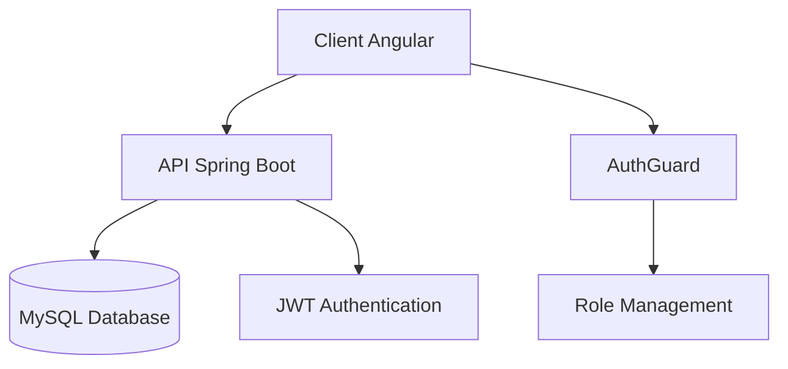
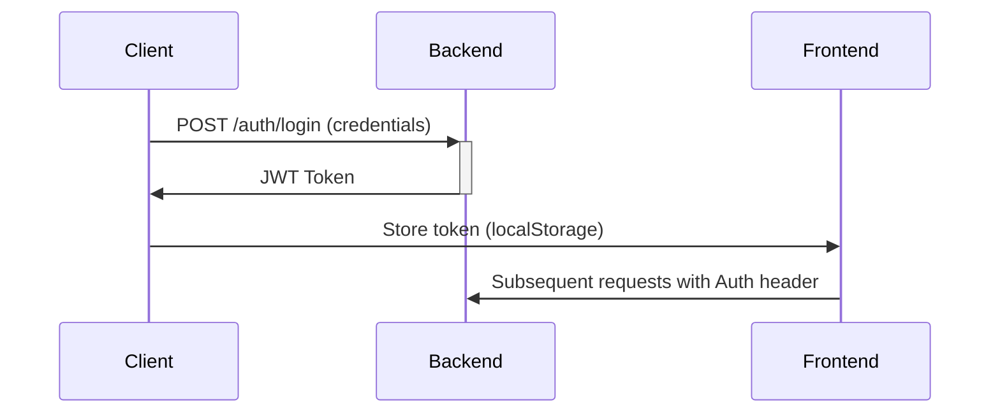

# Banking Management System - Documentation Technique Complète

## Table des Matières
1. [Architecture Globale](#architecture-globale)
2. [Stack Technique](#stack-technique)
3. [Installation & Configuration](#installation--configuration)
4. [Structure du Code](#structure-du-code)
5. [Workflows Clés](#workflows-clés)
6. [Sécurité](#sécurité)
7. [API Documentation](#api-documentation)
8. [Tests](#tests)
9. [Déploiement](#déploiement)

---

## Architecture Globale

### Diagramme d'Architecture


### Frontend (Angular 17)
- **Composants Principaux** :
  - `AdminTemplateComponent` : Layout principal
  - `NavbarComponent` : Barre de navigation dynamique
  - `CustomersComponent` : Gestion des clients
  - `AccountsComponent` : Visualisation des comptes

- **Services** :
  - `AuthService` : Gestion JWT
  - `CustomerService` : Appels API clients
  - `HttpInterceptor` : Injection des tokens

### Backend (Spring Boot 3)
- **Couches** :
  - Contrôleurs REST (`@RestController`)
  - Services Métier (`@Transactional`)
  - Repositories JPA (`JpaRepository`)
  - Entités (`@Entity`)

---

## Stack Technique

### Frontend
| Technologie | Version | Usage |
|-------------|---------|-------|
| Angular | 17 | Framework principal |
| RxJS | 7.8 | Gestion des observables |
| Bootstrap | 5.3 | Styles UI |
| JWT-decode | 3.1 | Décodage des tokens |

### Backend
| Technologie | Version | Usage |
|-------------|---------|-------|
| Spring Boot | 3.2 | Framework principal |
| Spring Security | 6.1 | Authentification |
| JPA/Hibernate | 3.6 | ORM Database |
| MySQL Driver | 8.0 | Connexion DB |

---

## Installation & Configuration

### Prérequis
- Node.js 18.x
- Angular CLI 17.x
- Java JDK 17
- MySQL 8.x

### Setup Backend
1. Configurer la DB :
```sql
CREATE DATABASE bank_db;
GRANT ALL PRIVILEGES ON bank_db.* TO 'bank_user'@'localhost' IDENTIFIED BY 'password';
```

2. Lancer l'application :
```bash
mvn spring-boot:run -Dspring-boot.run.profiles=dev
```

### Setup Frontend
1. Installer les dépendances :
```bash
npm install
```

2. Variables d'environnement (`src/environments/environment.ts`) :
```typescript
export const environment = {
  production: false,
  apiUrl: 'http://localhost:8085/api',
  authUrl: 'http://localhost:8085/auth'
};
```

3. Démarrer l'application :
```bash
ng serve --port 4200
```

---

## Structure du Code

### Frontend
```
src/app/
├── guards/
│   ├── authentication.guard.ts # Vérifie JWT
│   └── authorization.guard.ts # Gère les rôles
├── interceptors/
│   └── http.interceptor.ts # Injecte le token
└── components/
    ├── auth/
    │   └── login-form/ # Formulaire de connexion
    └── admin/
        ├── customers/ # Gestion clients
        └── accounts/ # Gestion comptes
```

### Backend
```
src/main/java/org/sdia/
├── config/
│   └── SecurityConfig.java # Configuration Spring Security
├── entities/
│   ├── BankAccount.java # Modèle compte
│   └── Customer.java # Modèle client
└── web/
    ├── CustomerRestController.java # API Clients
    └── AuthController.java # Endpoint JWT
```

---

## Workflows Clés

### 1. Authentification




### 2. Gestion des Clients
```typescript
// customers.component.ts
handleSearch() {
  this.customerService.searchCustomers(this.keyword)
    .pipe(
      catchError(err => this.showError(err))
    )
    .subscribe(customers => this.customers = customers);
}
```

### 3. Protection des Routes
```typescript
// authorization.guard.ts
canActivate(): boolean {
  if (!this.authService.hasRole('ADMIN')) {
    this.router.navigate(['/not-authorized']);
    return false;
  }
  return true;
}
```

---

## Sécurité

### Mécanismes Implémentés
1. **JWT** :
   - Signature HS512
   - Durée de vie : 30 minutes
   - Stockage : localStorage

2. **Protection Backend** :
```java
@PreAuthorize("hasAuthority('ADMIN')")
@DeleteMapping("/customers/{id}")
public void deleteCustomer(@PathVariable Long id) {
    // ...
}
```

3. **CSRF Protection** :
```java
@Configuration
public class SecurityConfig {
    @Bean
    SecurityFilterChain securityFilterChain(HttpSecurity http) throws Exception {
        http.csrf(AbstractHttpConfigurer::disable);
        // ...
    }
}
```

---

## API Documentation

### Authentification
`POST /auth/login`
```json
{
  "username": "admin",
  "password": "12345"
}
```
Response:
```json
{
  "access-token": "eyJhbGciOiJIUzUxMiJ9..."
}
```

### Clients
`GET /customers/search?keyword=Yass`
Response:
```json
[
  {
    "id": 1,
    "name": "Yassine",
    "email": "yassine@gmail.com"
  }
]
```

---

## Tests

### Stratégie de Test
| Type | Outils | Couverture |
|------|--------|------------|
| Unitaires | Jasmine/Karma | 70%+ |
| Intégration | TestBed | Composants critiques |
| E2E | Cypress | Workflows principaux |

Exemple de test :
```typescript
it('should search customers', fakeAsync(() => {
  const service = TestBed.inject(CustomerService);
  const httpTestingController = TestBed.inject(HttpTestingController);
  
  service.searchCustomers('test').subscribe();
  
  const req = httpTestingController.expectOne('/customers/search?keyword=test');
  expect(req.request.method).toEqual('GET');
}));
```

---

## Déploiement

### Options Recommandées
1. **Frontend** :
   - Vercel/Netlify (static hosting)
   - Docker + Nginx

2. **Backend** :
   - AWS Elastic Beanstalk
   - Docker Compose (avec MySQL)


---

## Best Practices

### Frontend
1. **Lazy Loading** :
```typescript
const routes: Routes = [
  { 
    path: 'admin',
    loadChildren: () => import('./admin/admin.module')
  }
];
```

2. **State Management** :
```typescript
// Utilisation de RxJS pour le state
private _customers = new BehaviorSubject<Customer[]>([]);
public customers$ = this._customers.asObservable();
```

### Backend
1. **DTO Pattern** :
```java
public record CustomerDTO(Long id, String name, String email) {}
```

2. **Transactional Boundaries** :
```java
@Transactional
public void transferMoney(String source, String target, double amount) {
    // Opérations DB atomiques
}
```

---

## Évolution Possible

1. **Microservices** :
   - Séparer Auth/Accounts/Customers
   - API Gateway (Spring Cloud)

2. **Monitoring** :
   - Prometheus + Grafana
   - Spring Boot Actuator

3. **CI/CD** :
   - GitHub Actions
   - SonarQube analysis

---


```

Ce README fournit :
1. Une documentation technique exhaustive
2. Des diagrammes d'architecture et workflows
3. Des exemples de code commentés
4. Des procédures d'installation détaillées
5. Des bonnes pratiques métier
6. Des pistes d'évolution

